<div align="center">

# Science Innovation Exam · Tasks

**面向研究 Agent 的动态科学基准 · 任务共建仓库**

[](https://prismax-team.github.io/LiveDiscoveryBench-Tasks/zh/)
[](https://prismax-team.github.io/LiveDiscoveryBench-Tasks/zh/contribute/)

**简体中文** | [English](README_EN.md)

[什么是 SIE](#-什么是-science-innovation-exam) · [共建流程](#-共建流程) · [任务包](#-任务包) · [仓库导航](#%EF%B8%8F-仓库导航) · [交流群](#-共建者交流群)

</div>

---

Science Innovation Exam（SIE）评测研究 Agent 能否面向**真实、尚未解决的前沿科学问题**，在开放环境中自主调研，提出并验证改进方案，取得可衡量的进展。

本仓库是 SIE 的**任务共建入口**：任务 Proposal 在这里公开讨论和审核，任务包通过 PR 进入基准，审核记录直接沉淀在 GitHub 上。一个 GitHub 账号就能提交、审核和署名。

## 🔬 什么是 Science Innovation Exam

大多数基准衡量模型**知道什么**；SIE 衡量 Agent 面对一个没有标准答案的科学问题时**能做到什么**。每个任务来自一个仍在推进的真实研究问题，Agent 拿到的是数据、环境和评分合同，而不是解题路径。

<table>
<tr>
<td width="50%">🧭 <b>Live Question</b><br>评测的不是解法明确的静态题目，而是仍未解决、值得不断推进的真实前沿问题。</td>
<td width="50%">🌐 <b>Live Environment</b><br>Agent 在开放环境中可以检索前沿方法；公开知识是研究的起点，而不是需要隔离的信息。</td>
</tr>
<tr>
<td>📏 <b>Live Metric</b><br>评分规则固定，比较坐标持续更新；每个结果都相对于其他 Agent 和当前前沿来衡量。</td>
<td>🤝 <b>Live Community</b><br>基准不是一次性封闭发布的题库，而由研究者、领域专家等贡献者持续共同发现、构建和完善。</td>
</tr>
<tr>
<td>🔒 <b>确定性验证</b><br>Verifier 在运行前冻结并离线评分；相同的冻结输入、Validation 历史、Context 和提交必须得到相同结果。</td>
<td>🛡️ <b>受控评测</b><br>资源与网络边界预先固定，研究过程被完整记录与审计，防止 hacking、访问隐藏输入或绕过约束获得虚假高分。</td>
</tr>
</table>

科学标准与任务实例见[官网](https://prismax-team.github.io/LiveDiscoveryBench-Tasks/zh/)。

## 🚀 共建流程

一个任务分两步进入 SIE：先提交公开 **Proposal**，由一位领域专家审核；获批后再提交**任务 PR**，由一位领域专家和一位技术专家双审。全程在 GitHub 上完成，进度同步显示在[官网共建看板](https://prismax-team.github.io/LiveDiscoveryBench-Tasks/zh/contribute/#contribution-activity)。

```mermaid
flowchart LR
    A["1️⃣ 📝 提交 Proposal<br/>(Discussion)"] --> B["🧑‍🔬 领域专家审核"]
    B -->|获批| C["2️⃣ 🧩 构建任务包<br/>模板 / AI Skill"]
    C --> E["3️⃣ 🔀 提交任务 PR"]
    E --> F["🤖 CI 结构检查"]
    F --> G["👥 双审<br/>领域 + 技术"]
    G -->|合并| H["🌐 官网上线并署名"]

    style A fill:#dcfce7,stroke:#16a34a,stroke-width:3px
    style C fill:#dcfce7,stroke:#16a34a,stroke-width:3px
    style E fill:#dcfce7,stroke:#16a34a,stroke-width:3px
    style B fill:#f8fafc,stroke:#94a3b8,stroke-dasharray:4 3
    style F fill:#f8fafc,stroke:#94a3b8,stroke-dasharray:4 3
    style G fill:#f8fafc,stroke:#94a3b8,stroke-dasharray:4 3
    style H fill:#f8fafc,stroke:#94a3b8,stroke-dasharray:4 3
```



> 带序号的绿色实框 1️⃣ 2️⃣ 3️⃣ 是**你需要做的三步**；灰色虚框由维护者与 CI 完成，无需你操作。

| 步骤 | 你要做的 | 入口 |
| --- | --- | --- |
| 1. 提出任务 | 描述科学问题、数据来源、指标与授权 | [提交 Proposal](https://github.com/PrismaX-Team/LiveDiscoveryBench-Tasks/discussions/new?category=proposals) |
| 2. 构建任务包 | Fork 仓库，复制 `tasks/_template/`，或让 AI 编程助手按 Skill 生成，本地跑结构检查 | [共建指南](CONTRIBUTING.md) · [任务合同](https://prismax-team.github.io/LiveDiscoveryBench-Tasks/zh/contribute/task-contract/) |
| 3. 提交 PR | 从 fork 向 `main` 发起 PR，正文带上 `Proposal:` 行；等待维护者打标签与双审 | [PR 模板](.github/PULL_REQUEST_TEMPLATE/new_task.md) |

PR 按**改动用途**分类，由维护者确认唯一类型标签；标签确认前 Contribution gate 保持 pending 而非失败。

| 用途 | 标签 | 正文必需行 |
| --- | --- | --- |
| 新增任务 | `type:new-task` | `Proposal: https://github.com/PrismaX-Team/LiveDiscoveryBench-Tasks/discussions/NUMBER` |
| 任务修复 | `type:task-fix` | `Task: EXISTING_TASK_ID` |
| 仓库维护 | `type:maintenance` | 说明维护范围，无需 Proposal |

分步说明见 [CONTRIBUTING.md](CONTRIBUTING.md)，维护者与审核者规则见 [MAINTAINERS.md](MAINTAINERS.md)。

## 📦 任务包

每个任务是一份**严格五部分**的任务包，Agent 读到的、能用的、被评分的东西都在合同里写清楚。

```text
tasks/<task-id>/
├── instruction.json       Agent 开始前读到的任务说明、可见输入、最终产物、要求与上限
├── input/                 仅 Agent 可见的数据与提交模板
├── environment/
│   └── environment.json   可执行环境合同（default 镜像或 Containerfile）
├── verifier/
│   ├── validation/run/main.py   研究期间的反馈入口（--input --request --response）
│   └── test/run/main.py         冻结提交后的最终评分入口（--input --submission --result）
└── meta.json              任务身份、任务来源、原始指标、可选转换与实测 baseline
```

- 任务包内文本为英文；`<task-id>` 与 `meta.json.id` 一致。
- `input/` 只放 Agent 可见内容；隐藏评分数据放在 `verifier/test/` 下，validation 与 test 自包含。
- 双 verifier 入口均必需，须离线、确定性运行；旧的 `verifier/run/main.py` 不再使用。
- 构建历史、baseline 实现与审核报告放在任务包之外。共享的 Run-local `VerifyContext` 由框架提供，本仓库不含评测运行时。

字段级说明与带注释的完整示例见官网[任务合同详情页](https://prismax-team.github.io/LiveDiscoveryBench-Tasks/zh/contribute/task-contract/)；英文工作副本见 [`contributor/build-sie-task-package/task-contract.md`](contributor/build-sie-task-package/task-contract.md)。

## 🗂️ 仓库导航

| 路径 | 内容 |
| --- | --- |
| [`tasks/`](tasks/) | 已合并的正式任务包，每个子目录一道任务 |
| [`tasks/_template/`](tasks/_template/) | 结构合法的空任务包模板，复制后替换占位内容 |
| [`contributor/build-sie-task-package/`](contributor/build-sie-task-package/) | 给 AI 编程助手（Cursor、Codex、Claude Code）的 Skill：合同说明、schema、Containerfile 示例与本地检查脚本 |
| [`.github/workflows/`](.github/workflows/) | 结构校验、贡献治理与 Proposal 审核的 Actions；只检查格式与治理规则，不执行任务代码 |
| [`.github/scripts/`](.github/scripts/) | Actions 使用的可信策略脚本及其测试 |
| [`.github/PULL_REQUEST_TEMPLATE/`](.github/PULL_REQUEST_TEMPLATE/) | 新增任务、任务修复、仓库维护三种 PR 模板 |
| [`attribution.json`](attribution.json) | 未经公开 PR 登记的任务的作者与审核者 |
| [`CONTRIBUTING.md`](CONTRIBUTING.md) · [`CONTRIBUTING_EN.md`](CONTRIBUTING_EN.md) | 共建者指南 |
| [`MAINTAINERS.md`](MAINTAINERS.md) · [`MAINTAINERS_EN.md`](MAINTAINERS_EN.md) | 维护者与审核者指南 |

## 📮 参与

- 想提出一道任务：[提交 Proposal](https://github.com/PrismaX-Team/LiveDiscoveryBench-Tasks/discussions/new?category=proposals)
- 已有获批 Proposal：阅读 [CONTRIBUTING.md](CONTRIBUTING.md) 并提交任务 PR
- 了解基准：[官网](https://prismax-team.github.io/LiveDiscoveryBench-Tasks/zh/) · [共建页面](https://prismax-team.github.io/LiveDiscoveryBench-Tasks/zh/contribute/)
- 对现有任务的问题或修复建议：提交 `type:task-fix` PR，或在对应 Proposal 讨论串中留言

仓库、Proposal、PR 与审核记录均公开，请只提交可再分发的材料。

## 💬 共建者交流群

欢迎扫码加入 **SIE 共建者交流群**，与维护者和其他共建者讨论任务选题、任务包构建和审核中遇到的问题。

<p align="center"></p>

微信群二维码会定期过期。如果扫码提示已失效，请发邮件至 **vaporhugz@gmail.com**，我们会发送最新的入群方式。
