<div align="center">

# Science Innovation Exam · Tasks

**A live scientific benchmark for research agents · task contribution repository**

[](https://prismax-team.github.io/LiveDiscoveryBench-Tasks/en/)
[](https://prismax-team.github.io/LiveDiscoveryBench-Tasks/en/contribute/)

[简体中文](README.md) | **English**

[What is SIE](#-what-is-science-innovation-exam) · [How to contribute](#-how-to-contribute) · [Task package](#-task-package) · [Repository map](#%EF%B8%8F-repository-map) · [Community](#-contributor-community)

</div>

---

Science Innovation Exam (SIE) evaluates whether research agents can independently investigate **real, unresolved frontier scientific problems** in an open environment, propose and validate improvements, and make measurable progress.

This repository is the **task contribution entry point** for SIE: task Proposals are discussed and reviewed here in public, task packages enter the benchmark through pull requests, and review records live directly on GitHub. One GitHub account lets you submit, review and be credited.

## 🔬 What is Science Innovation Exam

Most benchmarks measure what a model **knows**; SIE measures what an agent can **do** when the scientific question has no known answer yet. Every task comes from a real research problem that is still moving. The agent receives data, an environment and a scoring contract, not a solution path.

<table>
<tr>
<td width="50%">🧭 <b>Live Question</b><br>Real frontier questions whose solutions remain open and worth advancing, not static problems with known solution paths.</td>
<td width="50%">🌐 <b>Live Environment</b><br>Agents can investigate frontier methods in an open environment; public knowledge is the starting point of research, not information to isolate.</td>
</tr>
<tr>
<td>📏 <b>Live Metric</b><br>Scoring rules stay fixed while the comparison frame keeps moving; every result is measured against other agents and the current frontier.</td>
<td>🤝 <b>Live Community</b><br>Not a closed, one-off task set: researchers, domain experts and other contributors continuously discover, build and improve the benchmark together.</td>
</tr>
<tr>
<td>🔒 <b>Deterministic verification</b><br>The verifier is frozen before a run and scores offline; the same frozen input, validation history, context and submission must produce the same result.</td>
<td>🛡️ <b>Controlled evaluation</b><br>Resource and network boundaries are fixed, and the research process is recorded and audited to prevent hacking, hidden-input access and invalid high scores.</td>
</tr>
</table>

Scientific standards and task examples are on the [official portal](https://prismax-team.github.io/LiveDiscoveryBench-Tasks/en/).

## 🚀 How to contribute

A task enters SIE in two steps: a public **Proposal** reviewed by a domain expert, then a **task PR** reviewed by a domain expert and a technical expert. Everything happens on GitHub, and progress is mirrored on the [portal's contribution board](https://prismax-team.github.io/LiveDiscoveryBench-Tasks/en/contribute/#contribution-activity).

```mermaid
flowchart LR
    A["📝 Submit Proposal<br/>(Discussion)"] --> B["🧑‍🔬 Domain expert review"]
    B -->|approved| C["🧩 Build task package<br/>template / AI skill"]
    C --> D["✅ Local check<br/>check_package.py"]
    D --> E["🔀 Open task PR"]
    E --> F["🤖 CI structure & governance"]
    F --> G["👥 Dual review<br/>domain + technical"]
    G -->|merged| H["🌐 Live on portal, credited"]

    style A fill:#e0f2fe,stroke:#0284c7
    style B fill:#fef3c7,stroke:#f59e0b
    style C fill:#f0fdf4,stroke:#22c55e
    style D fill:#f0fdf4,stroke:#22c55e
    style E fill:#f5f3ff,stroke:#8b5cf6
    style F fill:#f5f3ff,stroke:#8b5cf6
    style G fill:#fef3c7,stroke:#f59e0b
    style H fill:#e0f2fe,stroke:#0284c7
```



| Step | What you do | Where |
| --- | --- | --- |
| 1. Propose a task | Describe the scientific question, data sources, metric and permissions | [Submit Proposal](https://github.com/PrismaX-Team/LiveDiscoveryBench-Tasks/discussions/new?category=proposals) |
| 2. Build the package | Fork the repository, copy `tasks/_template/` or let an AI coding agent build it with the skill, run the local structural check | [Contributing guide](CONTRIBUTING_EN.md) · [Task contract](https://prismax-team.github.io/LiveDiscoveryBench-Tasks/en/contribute/task-contract/) |
| 3. Open the PR | Open a PR from your fork against `main` with the `Proposal:` line in the body; wait for the maintainer label and dual review | [PR template](.github/PULL_REQUEST_TEMPLATE/new_task.md) |

PRs are classified by **what they change**; a maintainer confirms exactly one type label. Until then the Contribution gate stays pending rather than failed.

| Purpose | Label | Required body line |
| --- | --- | --- |
| New task | `type:new-task` | `Proposal: https://github.com/PrismaX-Team/LiveDiscoveryBench-Tasks/discussions/NUMBER` |
| Task fix | `type:task-fix` | `Task: EXISTING_TASK_ID` |
| Repository maintenance | `type:maintenance` | Describe the scope; no Proposal needed |

Step-by-step instructions are in [CONTRIBUTING_EN.md](CONTRIBUTING_EN.md); maintainer and reviewer rules are in [MAINTAINERS_EN.md](MAINTAINERS_EN.md).

## 📦 Task package

Every task is a package with **exactly five top-level parts**. What the agent reads, what it can use and what gets scored are all written into the contract.

```text
tasks/<task-id>/
├── instruction.json       what the agent reads before starting: visible inputs, final artifacts, requirements, limits
├── input/                 agent-visible data and submission templates only
├── environment/
│   └── environment.json   executable environment contract (default image or Containerfile)
├── verifier/
│   ├── validation/run/main.py   research-time feedback entry (--input --request --response)
│   └── test/run/main.py         final scoring entry for the frozen submission (--input --submission --result)
└── meta.json              identity, task sources, raw metric, optional transform and measured baseline
```

- The package is English; `<task-id>` and `meta.json.id` must match.
- `input/` holds only agent-visible material; hidden scoring data lives under `verifier/test/`, and validation and test are self-contained.
- Both verifier entries are required and must run offline and deterministically; the old `verifier/run/main.py` is obsolete.
- Build history, baseline implementations and review reports stay outside the package. The framework supplies the shared run-local `VerifyContext`; this repository contains no evaluation runtime.

Field-by-field explanations with an annotated full example are on the portal's [task contract page](https://prismax-team.github.io/LiveDiscoveryBench-Tasks/en/contribute/task-contract/); the working copy of the field rules is [`contributor/build-sie-task-package/task-contract.md`](contributor/build-sie-task-package/task-contract.md).

## 🗂️ Repository map

| Path | Contents |
| --- | --- |
| [`tasks/`](tasks/) | Merged, official task packages, one directory per task |
| [`tasks/_template/`](tasks/_template/) | Structurally valid empty package; copy it and replace the placeholders |
| [`contributor/build-sie-task-package/`](contributor/build-sie-task-package/) | Skill for AI coding agents (Cursor, Codex, Claude Code): contract notes, schemas, Containerfile example and the local checker |
| [`.github/workflows/`](.github/workflows/) | Actions for structure validation, contribution governance and Proposal review; they check format and governance rules only and never run task code |
| [`.github/scripts/`](.github/scripts/) | Trusted policy scripts used by the Actions, with tests |
| [`.github/PULL_REQUEST_TEMPLATE/`](.github/PULL_REQUEST_TEMPLATE/) | PR templates for new task, task fix and maintenance |
| [`attribution.json`](attribution.json) | Authors and reviewers of tasks registered without a public PR |
| [`CONTRIBUTING_EN.md`](CONTRIBUTING_EN.md) · [`CONTRIBUTING.md`](CONTRIBUTING.md) | Contributor guide |
| [`MAINTAINERS_EN.md`](MAINTAINERS_EN.md) · [`MAINTAINERS.md`](MAINTAINERS.md) | Maintainer and reviewer guide |

## 📮 Get involved

- Have a task in mind: [submit a Proposal](https://github.com/PrismaX-Team/LiveDiscoveryBench-Tasks/discussions/new?category=proposals)
- Proposal already approved: read [CONTRIBUTING_EN.md](CONTRIBUTING_EN.md) and open the task PR
- Learn about the benchmark: [portal](https://prismax-team.github.io/LiveDiscoveryBench-Tasks/en/) · [contribute page](https://prismax-team.github.io/LiveDiscoveryBench-Tasks/en/contribute/)
- Problems with or fixes for an existing task: open a `type:task-fix` PR or comment on the task's Proposal thread

The repository, Proposals, PRs and review records are all public. Commit only redistributable material.

## 💬 Contributor community

Scan the code to join the **SIE contributor WeChat group** and discuss task ideas, task-package building and review questions with maintainers and other contributors.

<p align="center"></p>

WeChat group codes expire periodically. If the code no longer works, email **vaporhugz@gmail.com** and we will send you the current invitation.
